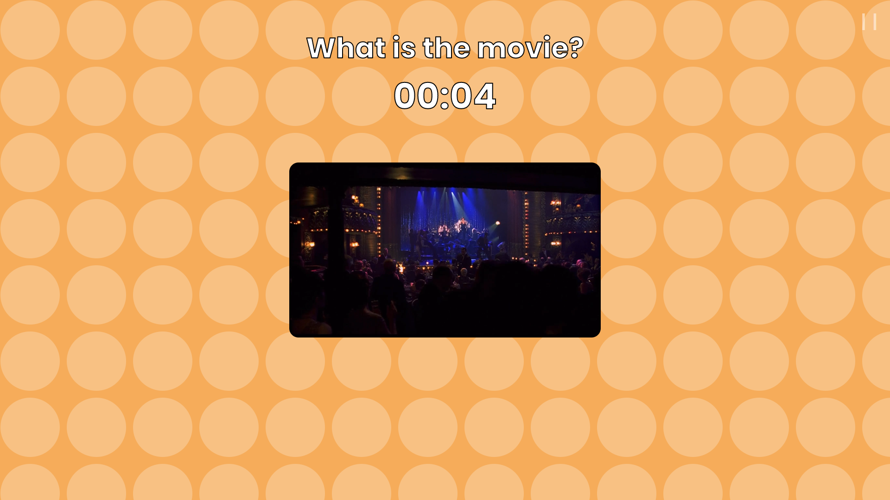
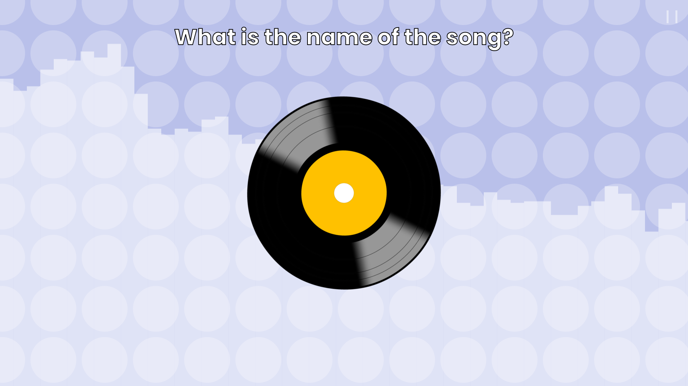
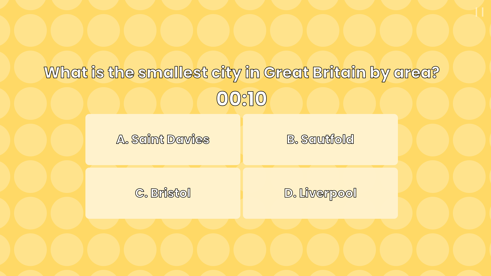

# british_quiz

this website is a project that was made for a school contest. it includes small games about english culture (i.e. guess the song, guess the film, etc.)

## ok and

unfortunately, the whole project cannot be uploaded to github, as i would receive a billion copyright strikes and get erased from this planet.

**the project is uploaded here for archival purposes, although i may upload the assets/ folder some(day/where) and it will become playable.**
i have also omitted several .js files (partyjs, jquery and animejs), since they are copies of the original libraries (from their cdns).

this is also not meant to be played by anyone else, and there are no tutorials, sorry :(

## code

the code might cause seizures in some programmers. be warned.

in all seriousness, it's a bodge i made in 2.5 days, so the code might look messy.

## screenshots

